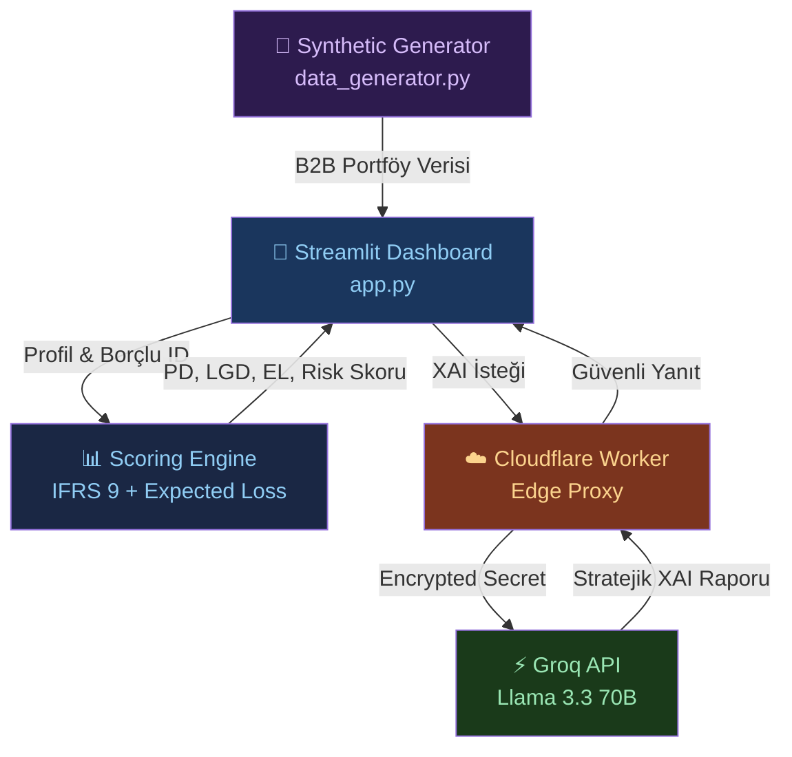

<div align="center">

# 🏦 AI Risk Scoring
### B2B Alacak Yönetimi için IFRS 9 Uyumlu Yapay Zeka Risk & Finansal Kayıp Platformu

[](https://python.org)
[](https://streamlit.io)
[](https://groq.com)
[](https://workers.cloudflare.com)
[](LICENSE)

> **IFRS 9 / Basel II Kredi Riski Standartları**, **Non-Linear Risk Eğrileri**, **Beklenen Finansal Zarar ($EL = PD \times LGD \times EAD$)**  
> ve **Llama 3.3 70B Büyük Dil Modeli** ile geliştirilmiş kurumsal B2B tahsilat ve alacak istihbaratı platformu.

</div>

---


---

## 🎯 Projenin Amacı & Finansal Katma Değer

Geleneksel B2B alacak yönetiminde borçlular yalnızca doğrusal gecikme gününe göre sıralanır; bu durum portföydeki gerçek **finansal sermaye kaybını** gizler.

Bu platform:
1. **IFRS 9 / Basel II Kredi Aşamalandırması (Staging)** mantığını B2B faturaya uyarlar.
2. Soyut puanların ötesine geçerek **Beklenen Finansal Zararı (Expected Loss in USD)** hesaplar.
3. Çok boyutlu **6 Faktörlü Radar Grafiği** ile borçluyu portföy ortalamasıyla kıyaslar.
4. **Llama 3.3 70B** aracılığıyla tahsilat yöneticisine savunulabilir, finansal kanıtlara dayalı **Açıklanabilir AI (XAI)** kararları üretir.

---

## ✨ Öne Çıkan Özellikler

| Özellik | Açıklama |
|---------|----------|
| **📈 IFRS 9 Kredi Staging** | Stage 1 (Sağlıklı 0-30g), Stage 2 (SICR 31-89g), Stage 3 (Temerrüt 90+g) |
| **💰 Beklenen Zarar (EL)** | $EL = PD \times LGD \times EAD$ formülüyle risk altındaki net dolar tutarı |
| **🕸️ 6 Boyutlu Risk Radarı** | Borçlunun risk poligonunu portföy benchmark'ı ile kıyaslayan Plotly Radar Chart |
| **🎛️ Stres Testi & Senaryolar** | Standart Model, Makroekonomik Kriz ve Likidite Odaklı dinamik ağırlık profilleri |
| **🤖 Llama 3.3 70B XAI Motoru** | Groq API üzerinden finansal göstergeleri Türkçe/İngilizce stratejik özete çevirir |
| **🔒 Edge Proxy Güvenliği** | Cloudflare Workers ile istemci tarafında sıfır API anahtarı ifşası |
| **🚨 Kritik Uyarı Paneli** | Portföydeki en yüksek riskli 5 borçlu için anlık finansal alarm kartları |

---

## 🏗️ Sistem Mimarisi



---

## ⚖️ Finansal Risk Modeli & Formülasyon

### 1. Beklenen Zarar Formülü (Expected Loss - EL)

$$\text{Expected Loss (EL)} = \text{PD} \times \text{LGD} \times \text{EAD}$$

- **PD (Probability of Default):** Kompozit risk skorundan kalibre edilen lojistik temerrüt olasılığı:
  $$PD = \frac{1}{1 + e^{-0.075 \times (\text{Risk Skoru} - 50)}}$$
- **LGD (Loss Given Default):** Sektörel tahsilat kaybı çarpanı:
  - *İnşaat:* %65 | *Perakende:* %55 | *Lojistik:* %45 | *Üretim:* %35 | *Teknoloji:* %25 | *Sağlık:* %15
- **EAD (Exposure at Default):** Açık fatura tutarı ($ USD).

---

### 2. IFRS 9 Kredi Riski Aşamaları (Staging)

| Aşama | Gecikme / Kriter | Anlamı & Aksiyon |
|-------|------------------|-------------------|
| **🟢 Stage 1** | 0 – 30 gün | **Sağlıklı (Performing):** Düşük PD, olağan faturalama döngüsü $\rightarrow$ *🟢 Bekle* |
| **🟠 Stage 2** | 31 – 89 gün / Kötüleşen Trend | **SICR (Önemli Risk Artışı):** Dikleşen risk eğrisi $\rightarrow$ *🟠 E-posta / Yapılandırma* |
| **🔴 Stage 3** | 90+ gün / Skor $\ge 80$ | **Temerrüt (Credit-Impaired):** Değer düşüklüğü $\rightarrow$ *🔴 Hemen Ara / İcra* |

---

### 3. Model Senaryoları & Ağırlık Profilleri

Platform, makroekonomik koşullara göre 3 farklı stres profili sunar:

| Parametre | ⚖️ Dengeli Model | 🚨 Makro Kriz Modu | 💰 Likidite Modu |
|-----------|-----------------|-------------------|------------------|
| **Non-Linear Gecikme** | %30 | %20 | %35 |
| **Açık Tutar (Log)** | %20 | %15 | %35 |
| **Sektör Riski (LGD)** | %15 | %25 | %5 |
| **Kredi Notu (PD)** | %10 | %20 | %5 |
| **Ödeme Geçmişi** | %15 | %10 | %10 |
| **İletişim Aralığı** | %10 | %10 | %10 |

---

## 🖥️ Arayüz ve Görsel Analitik

**Portföy Tablosu & Finansal Metrikler:**


**Bireysel Borçlu Analizi, Radar Grafiği & AI Karar Açıklaması:**


---

## 🔒 Güvenlik & Mimari Katmanı

```text
Streamlit Arayüzü  ──(API Key Yok)──>  Cloudflare Worker Proxy  ──(Encrypted Secret)──>  Groq Llama 3.3 70B
```

- API anahtarları istemci kodunda veya tarayıcıda bulunmaz.
- Cloudflare Edge katmanı hız sınırlandırması (rate-limiting) ve anahtar gizliliği sağlar.

---

## 🚀 Hızlı Başlangıç

```bash
# 1. Repoyu klonla
git clone https://github.com/emreerbasli/ai-risk-scoring.git
cd ai-risk-scoring

# 2. Bağımlılıkları yükle
pip install -r requirements.txt

# 3. Uygulamayı çalıştır
streamlit run app.py
```

---

<div align="center">

**Geliştirici:** [Emre Erbaşlı](https://github.com/emreerbasli)  
*IFRS 9 & Basel II Quantitative Credit Intelligence PoC*

</div>
