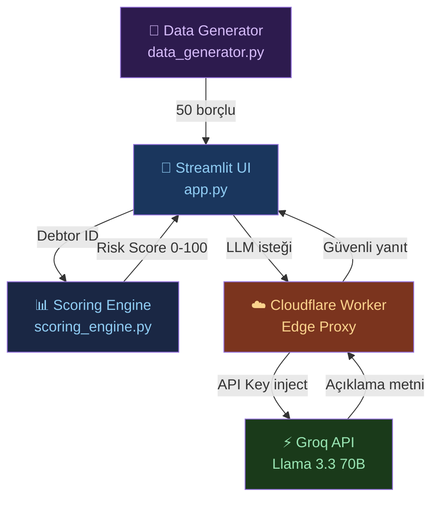
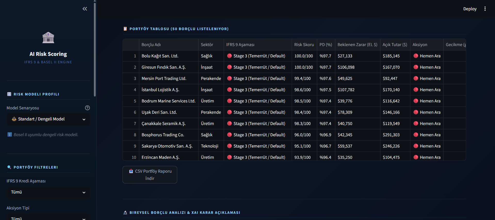
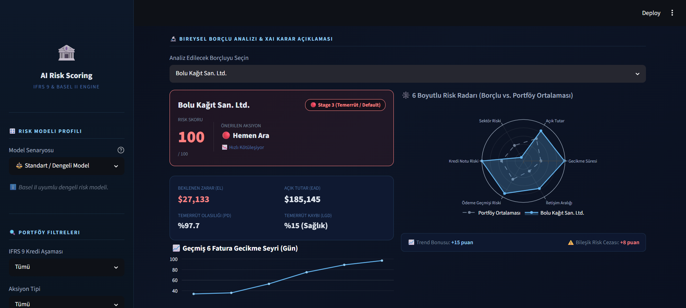

<div align="center">

# 🏦 AI Risk Scoring
### B2B Alacak Yönetimi için Yapay Zeka Destekli Borçlu Önceliklendirme Platformu

[](https://python.org)
[](https://streamlit.io)
[](https://groq.com)
[](https://workers.cloudflare.com)
[](LICENSE)

> **Kural tabanlı risk skorlama algoritması** ile **Llama 3.3 70B büyük dil modeli** entegrasyonunu birleştiren,  
> B2B tahsilat ekipleri için açıklanabilir yapay zeka karar destek sistemi.

</div>

---


---

## 🎯 Projenin Amacı

Geleneksel B2B tahsilat süreçlerinde borçlular genellikle **sadece gecikme günü veya tutar** gibi tek bir kritera göre önceliklendirilir. Bu yaklaşım eksik ve subjektiftir.

Bu proje, 6 farklı boyutu ağırlıklı bir formülle birleştirerek **0-100 arası matematiksel bir risk skoru** üretir ve bu kararı bir LLM aracılığıyla **insan analist dilinde açıklar**. Sonuç: daha hızlı, daha tutarlı ve savunulabilir tahsilat kararları.

---

## ✨ Özellikler

| Özellik | Açıklama |
|---------|----------|
| **📊 6 Faktörlü Risk Skoru** | Gecikme, tutar, ödeme geçmişi, sektör riski, kredi notu ve iletişim sıklığı |
| **🤖 LLM Açıklaması** | Llama 3.3 70B, neden o aksiyonun önerildiğini Türkçe/İngilizce açıklar |
| **📈 Trend Analizi** | 6 faturalık geçmiş gecikme trendi — kötüleşen borçlular erken tespit edilir |
| **🔒 Güvenli API Mimarisi** | API anahtarları hiçbir zaman istemci tarafında açığa çıkmaz (Cloudflare proxy) |
| **📉 Görsel Analitik** | Sektörel dağılım pie chart, bireysel sparkline grafikler, skor bileşen breakdown |
| **📥 CSV Dışa Aktarım** | Filtrelenmiş portföyü tek tıkla export et |
| **🌐 Çift Dil Desteği** | LLM açıklamaları Türkçe veya İngilizce üretilebilir |

---

## 🏗️ Sistem Mimarisi



### Bileşenler

| Dosya | Rol |
|-------|-----|
| [`data_generator.py`](data_generator.py) | Gerçekçi B2B borçlu profili üretir (sektör, kredi notu, geçmiş gecikmeler) |
| [`scoring_engine.py`](scoring_engine.py) | 6 faktörlü ağırlıklı formülü uygular, 0-100 risk skoru üretir |
| [`llm_engine.py`](llm_engine.py) | Borçlu bağlamını prompt'a çevirir, Groq API ile açıklama üretir |
| [`app.py`](app.py) | Streamlit arayüzü — filtreler, tablolar, grafikler, LLM entegrasyonu |

---

## ⚖️ Risk Formülü

Algoritma 6 boyutu ağırlıklı olarak birleştirir:

```
Risk Skoru =
  (Gecikme Günü × 0.30)   +
  (Açık Tutar   × 0.20)   +
  (Ödeme Geçmişi × 0.15)  +   ← Ters orantılı: iyi geçmiş = düşük risk
  (Sektör Riski × 0.15)   +
  (Kredi Notu   × 0.10)   +
  (Son İletişim × 0.10)   +
  Trend Bonusu (±15)           ← Hızlı kötüleşme +15, hızlı iyileşme -10
```

**Aksiyon Eşikleri:**

| Skor | Aksiyon | Anlamı |
|------|---------|--------|
| 80–100 | 🔴 Hemen Ara | Kritik — derhal müdahale |
| 60–79 | 🟠 E-posta At | Yüksek risk — yazılı iletişim |
| 40–59 | 🟡 Takipte Tut | Orta risk — izlemeye al |
| 0–39 | 🟢 Bekle | Düşük risk — bekle |

**Sektör Risk Ağırlıkları:**

| Sektör | Risk Puanı |
|--------|-----------|
| İnşaat | 100 (En Yüksek) |
| Perakende | 80 |
| Lojistik | 60 |
| Üretim | 40 |
| Teknoloji | 20 |
| Sağlık | 10 (En Düşük) |

---

## 🖥️ Ekran Görüntüleri

**Borçlu Tablosu & Filtreleme:**



**Bireysel Borçlu Analizi & AI Açıklaması:**



---

## 🔒 Güvenlik Mimarisi

Bu proje, API anahtarlarını istemci tarafında **hiçbir zaman** açığa çıkarmaz:

```
Streamlit App  →  Cloudflare Worker  →  Groq API
     ↓                   ↓
  API key yok      API key inject      Llama 3.3 70B
  (güvenli)        (edge secret)       yanıtı döner
```

Cloudflare Worker sunucusuz bir edge proxy olarak çalışır. `ZOLVO_API_KEY` yalnızca Cloudflare'in encrypted secrets deposunda tutulur.

---

## 🚀 Kurulum

### Gereksinimler
- Python 3.10+
- Cloudflare hesabı (güvenlik katmanı için)
- Groq API anahtarı

### Adımlar

**1. Repoyu klonla**
```bash
git clone https://github.com/emreerbasli/ai-risk-scoring.git
cd ai-risk-scoring
```

**2. Bağımlılıkları yükle**
```bash
pip install -r requirements.txt
```

**3. Cloudflare Worker'ı yapılandır**

Cloudflare Dashboard'da bir Worker oluştur ve Groq API anahtarını `ZOLVO_API_KEY` adıyla encrypted secret olarak ekle.

`llm_engine.py` dosyasındaki `base_url` parametresini kendi Worker URL'inle güncelle:
```python
base_url = "https://your-worker.your-subdomain.workers.dev"
```

**4. Uygulamayı başlat**
```bash
streamlit run app.py
```

Uygulama varsayılan olarak `http://localhost:8501` adresinde açılır.

---

## 🛠️ Teknoloji Yığını

| Katman | Teknoloji |
|--------|-----------|
| **Arayüz** | Python · Streamlit |
| **Veri İşleme** | Pandas · NumPy |
| **Görselleştirme** | Plotly |
| **Yapay Zeka (LLM)** | Meta Llama 3.3 70B · Groq API |
| **Güvenlik Proxy** | Cloudflare Workers (Serverless Edge) |
| **Versiyon Kontrolü** | Git · GitHub |

---

## 📁 Proje Yapısı

```
ai-risk-scoring/
├── app.py                 # Ana Streamlit arayüzü (dashboard, filtreler, LLM entegrasyonu)
├── scoring_engine.py      # 6 faktörlü risk skorlama algoritması
├── data_generator.py      # Gerçekçi B2B borçlu verisi üretici
├── llm_engine.py          # Groq API entegrasyonu ve prompt mühendisliği
├── requirements.txt       # Python bağımlılıkları
├── assets/                # Ekran görüntüleri
│   ├── dashboard_top.png
│   ├── dashboard_table.png
│   └── dashboard_details.png
└── .gitignore
```

---

## 🔮 Potansiyel Geliştirmeler

- [ ] Gerçek zamanlı ERP / muhasebe sistemi entegrasyonu (SAP, Logo)
- [ ] REST API katmanı (FastAPI) — diğer sistemlerin risk skoru sorgulayabilmesi için  
- [ ] Zaman serisi bazlı makine öğrenmesi modeli (kural tabanlı sistemin yanında)
- [ ] E-posta ve SMS otomasyonu (aksiyonu doğrudan tetikle)
- [ ] Multi-tenant yapı (birden fazla şirket portföyü)

---

<div align="center">

**Geliştirici:** [Emre Erbaşlı](https://github.com/emreerbasli)

*Bu proje, Generatif Yapay Zeka'nın B2B tahsilat süreçlerine entegrasyonunu gösteren bir Proof of Concept çalışmasıdır.*

</div>
